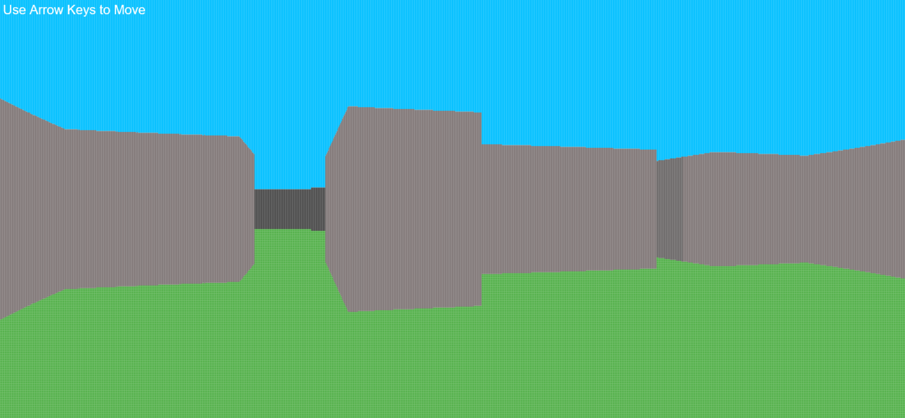
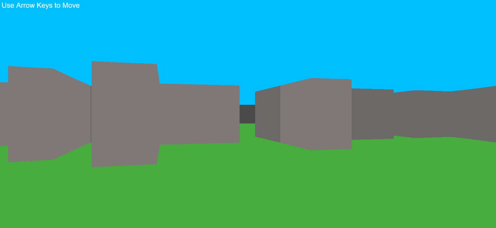

# RachitCaster
This is an older, slower version of this raycaster, based off OneLoneCoder's work. I wrote it a number of years ago as a beginner, so the code quality is not...great. It has since been improved drastically in a newer, faster version of RachitCaster with added features that is based off Lode Vandevenne's work.

There is a visual artifact that can be seen, and this is due to a decimal scalefactor. However, I purposely kept this because I feel it balances between detail, a retro-feel, and performance (having a 1-1 scalefactor is very slow). Here is what it looks like with an integer scalefactor (specifically set to 1):

If you want a video of operation, refer to `demonstration.mp4`

The reason this raycaster is very slow is because it draws very small rectangles for almost every pixel (depending on the scale factor, a scale factor of 1 would mean every rectangle drawn is the size of a pixel) in the entire window. A much better approach would be writing to an image buffer directly, which would only require one canvas draw call to put the image buffer on the canvas using `ctx.putImageData()`. In fact, this is the approach the newer version uses.

Live demo available with Github Pages.
